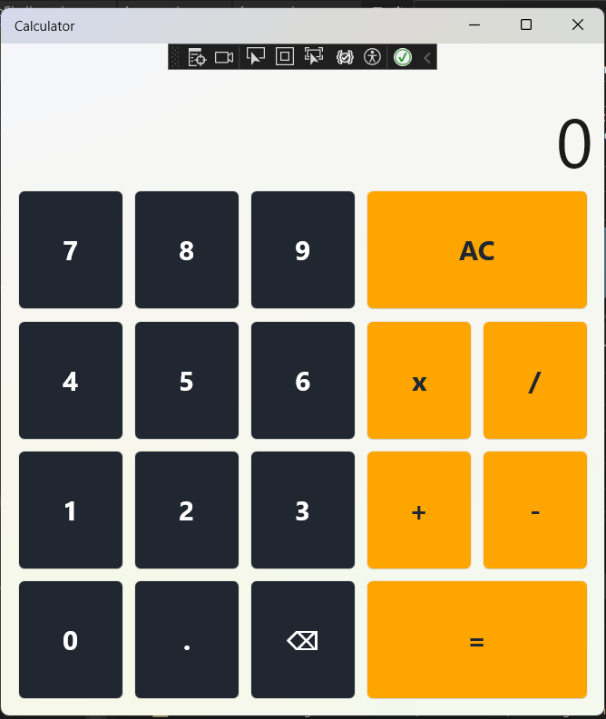

# MAUI Calculator

## Description

MAUI Calculator is a basic calculator app built using .NET MAUI. It allows users to perform addition, subtraction, multiplication, and division operations on numbers.

## Screenshots

### Main Page

## Features

- **Basic Arithmetic Operations:** Perform addition, subtraction, multiplication, and division.
- **Clear Button:** Reset the calculator to start a new calculation.
- **Backspace Button:** Delete the last entered digit.
- **Decimal Numbers:** Support for decimal numbers in calculations.

## Installation

1. Clone the repository to your local machine.
2. Ensure you have .NET 8.0 and .NET MAUI installed.
3. Open the project in Visual Studio or your preferred IDE.
4. Build and run the application.

## Usage

1. Launch the MAUI Calculator app.
2. Use the number buttons to input digits.
3. Use the operator buttons to perform addition, subtraction, multiplication, or division.
4. Press the equals button to see the result on the screen.

## Technologies Used

- .NET 8.0
- .NET MAUI

## Contributing

Contributions to this project are welcome!

## License

This project is licensed under the MIT License - see the [LICENSE](LICENSE) file for details.
